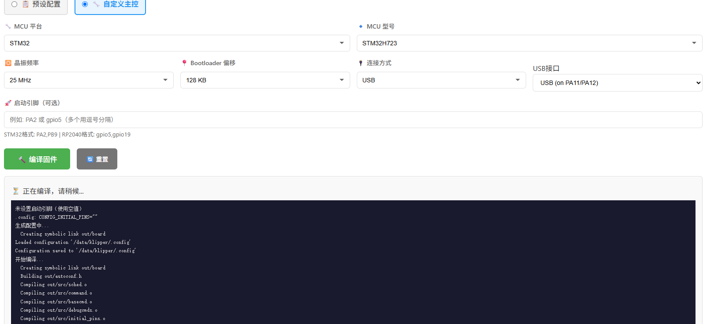

# Klipper WebUI Tools

为 Klipper 3D 打印系统扩展 WebUI 功能，支持 Mainsail 和 Fluidd。

## 功能特性

### 固件管理
- **固件编译** - 支持主板预设和自定义配置，一键编译 Klipper 固件
- **固件刷写** - 支持 DFU 模式自动刷写
- **固件下载** - 下载编译好的固件文件到本地

### 主板预设
- 支持多家厂商：BigTreeTech、Creality、FLY、FYSETC、LDO、Makerbase
- 自动填充 MCU 平台、型号、晶振等参数
- 可自定义 Bootloader 和连接方式

### 软件管理
- **KlipperScreen** - 触摸屏界面安装/更新
- **Crowsnest** - 摄像头流媒体安装/更新
- 自动配置 Moonraker 更新管理器

### 多语言支持
- 中文界面
- 英文界面

## 支持的 MCU 平台

| 平台 | 型号示例 |
|------|----------|
| STM32 | STM32F103, STM32F407, STM32F446, STM32H723, STM32H743 |
| RP2040 | rp2040, rp2350 |
| LPC176x | LPC1768, LPC1769 |
| AVR | atmega2560, atmega1284p |
| ATSAMD | SAMD21, SAMD51 |
| ATSAM | SAM3X8E, SAM4S8C |

## 安装方法

### 一键安装（推荐）

```bash
cd ~
git clone https://github.com/angelassie/Klipper_WebUI_TOOLS.git
cd Klipper_WebUI_TOOLS
./install.sh
```

### 手动安装

```bash
# 1. 克隆仓库
git clone https://github.com/angelassie/Klipper_WebUI_TOOLS.git

# 2. 复制 Moonraker 组件
cp Klipper_WebUI_TOOLS/moonraker/firmware.py ~/moonraker/moonraker/components/

# 3. 复制 WebUI 前端（根据你使用的 WebUI 选择）
# Mainsail 用户：
cp -r Klipper_WebUI_TOOLS/mainsail/dist/* ~/mainsail/

# Fluidd 用户：
cp -r Klipper_WebUI_TOOLS/fluidd/dist/* ~/fluidd/

# 4. 重启 Moonraker
sudo systemctl restart moonraker
```

## 更新方法

```bash
cd ~/Klipper_WebUI_TOOLS
git pull
./install.sh
```

## 卸载方法

```bash
cd ~/Klipper_WebUI_TOOLS
./uninstall.sh
```

## 配置说明

安装脚本会自动在 `moonraker.conf` 中添加以下配置：

```ini
[firmware]
klipper_path: ~/klipper
restart_klipper: False
```

## 添加新主板

编辑 `mcu_boards.csv` 文件，按以下格式添加：

```csv
厂商,型号,平台,MCU,晶振,Bootloader,连接方式,描述
BigTreeTech,SKR 3,STM32,STM32H743,25 MHz crystal,128KiB bootloader,USB (PA11/PA12),SKR 3 高性能主板
```

## 目录结构

```
Klipper_WebUI_TOOLS/
├── README.md                    # 项目说明
├── LICENSE                      # GPL-3.0 协议
├── install.sh                   # 安装脚本
├── uninstall.sh                 # 卸载脚本
├── moonraker/
│   └── firmware.py              # Moonraker 组件
├── mainsail/
│   └── dist/                    # Mainsail 前端
├── fluidd/                      # Fluidd 前端（开发中）
│   └── dist/
├── mcu_boards.csv               # 主板数据库
└── docs/
    └── screenshots/
```

## 截图



## 系统要求

- Klipper 已安装
- Moonraker 已安装
- Mainsail 或 Fluidd 已安装
- Linux 系统（Raspberry Pi OS、Debian、Ubuntu 等）

## 许可证

本项目采用 [GPL-3.0](LICENSE) 协议开源。

## 贡献

欢迎提交 Issue 和 Pull Request！

## 致谢

- [Klipper](https://www.klipper3d.org/) - 3D 打印机固件
- [Moonraker](https://moonraker.readthedocs.io/) - API 服务器
- [Mainsail](https://mainsail.xyz/) - WebUI
- [Fluidd](https://docs.fluidd.xyz/) - WebUI
